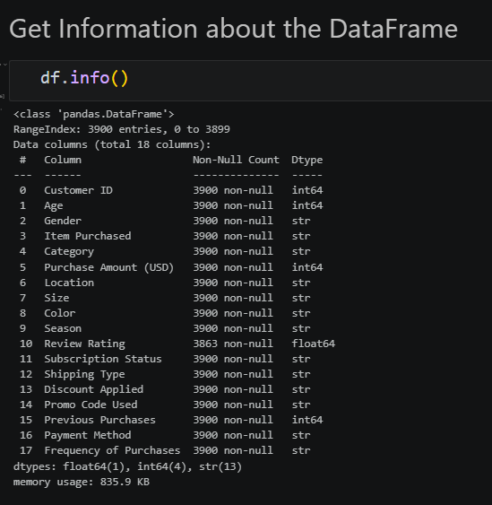
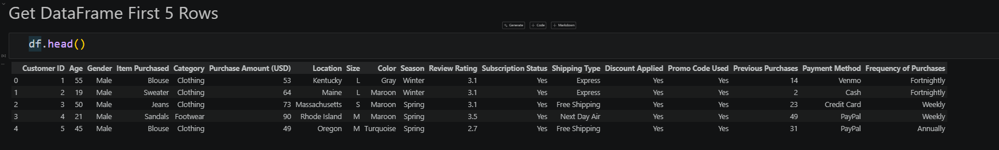
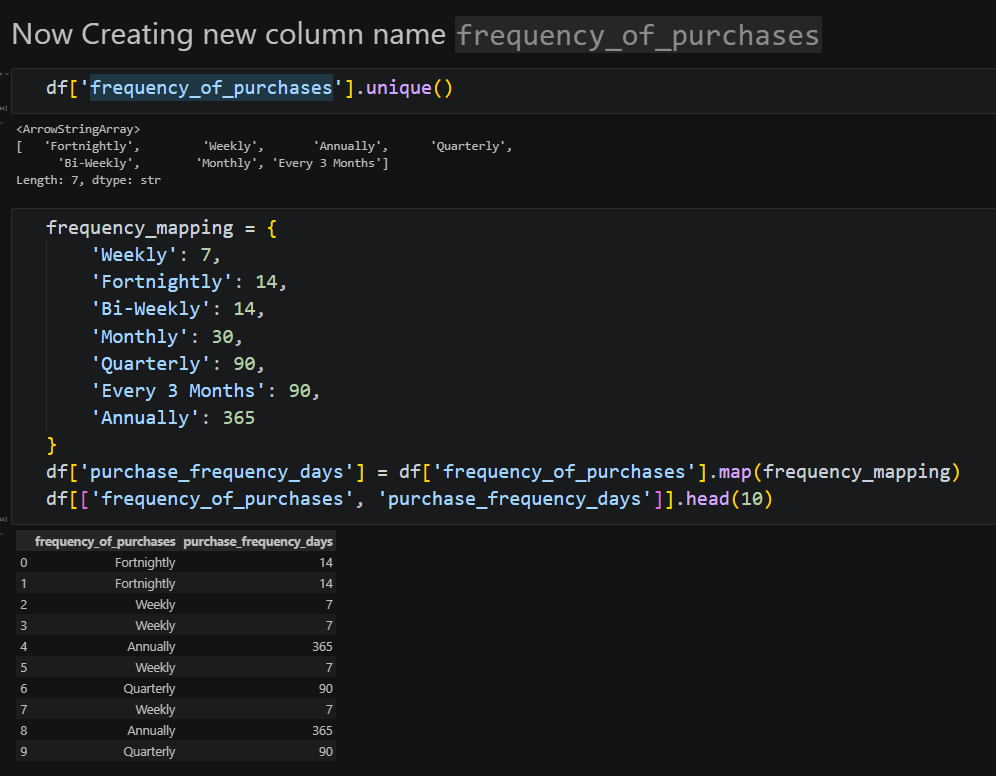
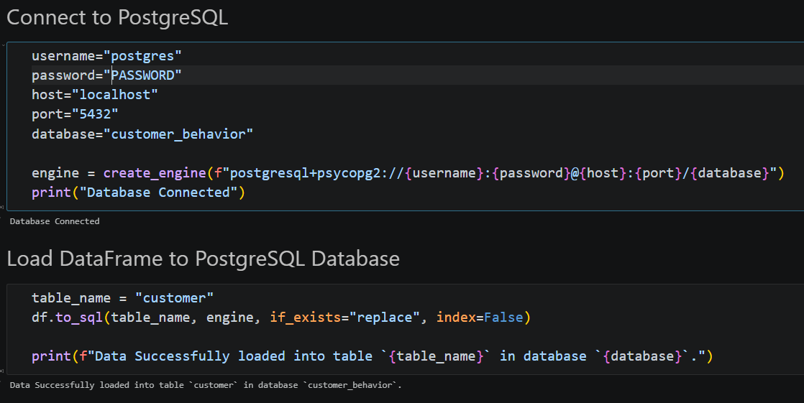

# Customer Trends Data Analysis

A complete customer shopping behavior analytics project that cleans and prepares retail transaction data with Python, stores the transformed dataset in PostgreSQL, and presents interactive business metrics in Power BI.

## Project Overview

This project analyzes customer purchases, product categories, customer demographics, subscription status, discounts, purchase frequency, ratings, and fulfillment preferences.

The workflow is:

1. Load the customer shopping dataset with pandas.
2. Inspect the structure, sample records, statistics, and missing values.
3. Clean and standardize the dataset.
4. Create analysis-ready age and purchase-frequency fields.
5. Remove a duplicated promotion field.
6. Load the prepared data into PostgreSQL.
7. Connect the data to Power BI for dashboard reporting.
8. Generate evidence-based business insights.

## Project Files

| File or folder | Description |
| --- | --- |
| `customer_shopping_behavior.csv` | Source customer shopping dataset. |
| `main.ipynb` | Python notebook containing the data preparation and PostgreSQL loading workflow. |
| `customer_behavior_dashboard.pbix` | Power BI dashboard file. |
| `insights.md` | Concise business insights derived from the analysis. |
| `screen_shorts/` | Screenshots documenting the notebook workflow and dashboard. |

## Dataset Summary

The source dataset contains 3,900 customer purchase records and 18 columns.

- Purchase amount ranges from $20 to $100, with an average of $59.76.
- Customer ages range from 18 to 70 years, with an average age of 44.07.
- Review ratings range from 2.5 to 5.0, with an average rating of 3.75.
- Previous purchases range from 1 to 50, with an average of 25.35.
- `Review Rating` contains 37 missing values before cleaning.
- All other source columns are complete.

### Source Columns

| Column | Description |
| --- | --- |
| `Customer ID` | Unique customer identifier. |
| `Age` | Customer age. |
| `Gender` | Customer gender. |
| `Item Purchased` | Product purchased. |
| `Category` | Product category. |
| `Purchase Amount (USD)` | Transaction amount in US dollars. |
| `Location` | Customer location. |
| `Size` | Purchased product size. |
| `Color` | Product color. |
| `Season` | Season associated with the purchase. |
| `Review Rating` | Customer rating for the purchase. |
| `Subscription Status` | Whether the customer has a subscription. |
| `Shipping Type` | Selected delivery or collection method. |
| `Discount Applied` | Whether a discount was applied. |
| `Promo Code Used` | Whether a promotion code was used. |
| `Previous Purchases` | Number of earlier purchases. |
| `Payment Method` | Payment method used. |
| `Frequency of Purchases` | Reported purchase frequency. |

## Data Preparation

The notebook performs the following transformations:

### Missing review ratings

Missing values in `Review Rating` are filled with the median rating for the corresponding product category.

### Standardized column names

Column names are converted to lowercase snake case, and `purchase_amount_(usd)` is renamed to `purchase_amount`.

### Age groups

Customer ages are divided into four equally sized quantile groups:

- Young Adult
- Adult
- Middle Aged
- Senior

### Purchase frequency in days

The categorical purchase-frequency field is converted into an approximate number of days between purchases:

| Frequency | Days |
| --- | ---: |
| Weekly | 7 |
| Fortnightly | 14 |
| Bi-Weekly | 14 |
| Monthly | 30 |
| Quarterly | 90 |
| Every 3 Months | 90 |
| Annually | 365 |

The resulting field is named `purchase_frequency_days`.

### Duplicate promotion field

`Promo Code Used` duplicates `Discount Applied` in the source data, so it is removed from the prepared DataFrame before loading it to PostgreSQL.

## Technology Stack

- Python
- pandas
- SQLAlchemy
- PostgreSQL
- Power BI
- Jupyter Notebook

## Requirements

Install the Python dependencies with:

```bash
pip install pandas sqlalchemy psycopg2-binary jupyter
```

You also need:

- Python 3.9 or newer
- PostgreSQL running locally
- A PostgreSQL database named `customer_behavior`
- Power BI Desktop to open the `.pbix` dashboard

## Running the Notebook

1. Open the project folder in VS Code or Jupyter.
2. Place `customer_shopping_behavior.csv` beside `main.ipynb`.
3. Start Jupyter or open the notebook using the Python extension.
4. Run the notebook from top to bottom.
5. Confirm that the cleaned DataFrame is written to the PostgreSQL table named `customer`.

The notebook expects the CSV at:

```text
./customer_shopping_behavior.csv
```

## PostgreSQL Setup

Create the database before running the export step:

```sql
CREATE DATABASE customer_behavior;
```

The notebook uses SQLAlchemy to connect to PostgreSQL and writes the prepared DataFrame with:

```python
df.to_sql("customer", engine, if_exists="replace", index=False)
```

For local development, configure database credentials through environment variables or a local secrets file rather than committing passwords to source control.

Example connection pattern:

```python
import os
from sqlalchemy import create_engine

username = os.getenv("POSTGRES_USER", "postgres")
password = os.getenv("POSTGRES_PASSWORD")
host = os.getenv("POSTGRES_HOST", "localhost")
port = os.getenv("POSTGRES_PORT", "5432")
database = os.getenv("POSTGRES_DB", "customer_behavior")

engine = create_engine(
    f"postgresql+psycopg2://{username}:{password}@{host}:{port}/{database}"
)
```

## Power BI Dashboard

The Power BI report provides interactive filtering and visual analysis for:

- Average purchase amount
- Customer count
- Average review rating
- Subscription status
- Revenue by category
- Sales by category
- Revenue by age group
- Sales by age group
- Gender
- Shipping type

The dashboard includes slicers for subscription status, gender, category, and shipping type, allowing users to compare customer segments and product groups.

> The dashboard screenshot shows a filtered view, so its KPI values can differ from full-dataset totals.

## Key Insights

- Clothing is the largest category with 1,737 purchases, generating $104,264, or about 52% of total purchase value.
- Outerwear has the lowest average purchase amount at $57.17, compared with $60.26 for Footwear.
- Male customers represent 68% of purchases, but their average purchase amount is nearly the same as female customers at $59.54 versus $60.25.
- Subscribers account for 27% of customers and average 26.08 previous purchases, compared with 25.08 among non-subscribers.
- Discounted orders make up 43% of purchases and have a lower average purchase amount than non-discounted orders at $59.28 versus $60.13.
- Young Adult customers have the highest average purchase amount at $60.45, while Seniors have the lowest at $59.07.
- Purchase frequency is broadly distributed, with Every 3 Months being the most common pattern at 584 customers and Weekly the least common at 539.
- Customer ratings average 3.75 out of 5, with Footwear receiving the highest category average at 3.79.

## Screenshots

### Dataset inspection

The notebook confirms the dataset dimensions, column types, and missing review-rating values.



### Initial records

The first five records show the original customer, product, purchase, rating, subscription, shipping, and payment fields.



### Purchase-frequency transformation

The notebook maps purchase-frequency labels to approximate day intervals for analysis.



### PostgreSQL export

The cleaned DataFrame is written to the PostgreSQL `customer` table in the `customer_behavior` database.



### Power BI dashboard

The dashboard combines KPI cards, slicers, category charts, age-group comparisons, and subscription analysis.


## Notes

- The age groups are quantile-based, so their boundaries depend on the age distribution in the source data.
- The purchase-frequency day values are analytical approximations rather than transaction timestamps.
- The notebook fills missing review ratings before exporting the prepared data.
- The PostgreSQL export uses `if_exists="replace"`, which replaces the existing `customer` table when rerun.
